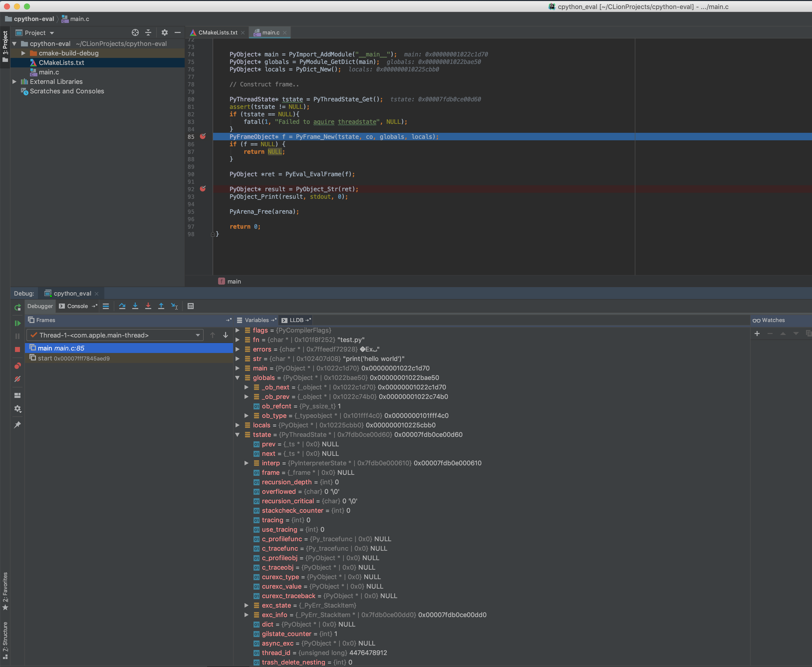

# cpython-clion-demo
Demo of debugging CPython from CLion

## Usage

1. Clone this repository and open it up as a project in CLion
2. Clone CPython 3.8 and build it with `--with-pydebug` (see CPython devguide for instructions)
3. Edit CMakeLists.txt and set the `CPYTHON_SOURCE` to the path to the root of your CPython source (and built) copy
4. Change the debug configurations to set the targeted executable and have an argument with any Python statement in quotes.
 
5. Run the debugger with breakpoints around https://github.com/tonybaloney/cpython-clion-demo/blob/master/main.c#L80-L93
6. Add watches to `co`, `tstate`, etc.

## Screenshots

